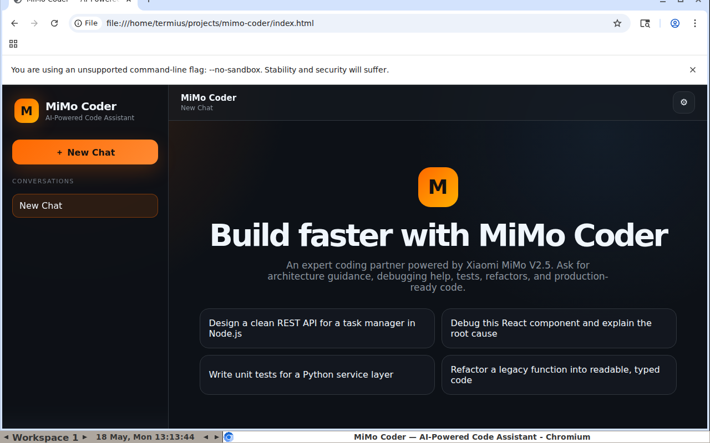
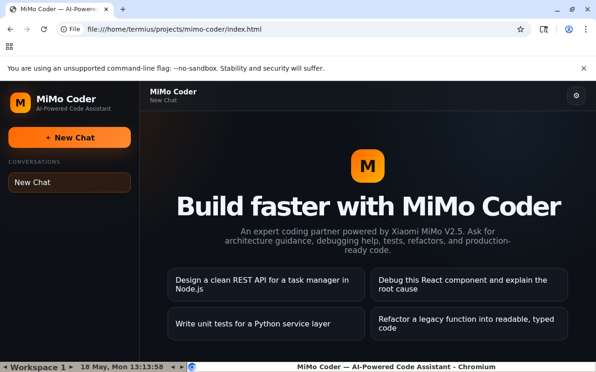

# MiMo Coder


**MiMo Coder** is an AI-powered code assistant web application that integrates directly with the **Xiaomi MiMo V2.5 API**. It provides a modern, Cursor-inspired chat workspace for software engineering tasks including code generation, debugging, refactoring, architecture design, and technical explanations — all running entirely in the browser with zero build tools.

> Built as part of the **Xiaomi MiMo Orbit 100T Token Creator Incentive Program** to demonstrate real-world MiMo API integration and AI-driven development workflows.

## Screenshots





## Features

- **Xiaomi MiMo V2.5 API integration** using OpenAI-compatible `/chat/completions` streaming endpoint
- **Real-time streaming responses** via Server-Sent Events (SSE)
- **Markdown rendering** with marked.js — headers, lists, bold, italic, links
- **Syntax-highlighted code blocks** with highlight.js (multi-language)
- **Copy code button** on every code block for instant clipboard access
- **Multi-conversation support** — create, switch, and delete chat sessions
- **Persistent localStorage** — conversations and API key survive browser restarts
- **Settings modal** for secure API key configuration
- **Responsive mobile layout** with collapsible sidebar
- **Welcome screen** with curated coding prompts to get started

## How to Use

No installation, build step, or server required.

1. Clone this repository:
   ```bash
   git clone https://github.com/owiagent123-maker/mimo-coder.git
   cd mimo-coder
   ```
2. Open `index.html` in any modern browser
3. Click the gear icon (⚙) in the top-right corner
4. Paste your Xiaomi MiMo API key and save
5. Start chatting with MiMo Coder

## How It Was Built — AI-Driven Development Workflow

This project was built entirely through an **AI-driven development pipeline** using **Hermes Agent** as the primary orchestration tool, with **Xiaomi MiMo V2.5 Pro** as the reasoning backbone.

### Development Process

1. **Planning & Architecture** — Hermes Agent analyzed the project requirements, designed the component architecture (chat UI, API layer, state management, persistence), and created a detailed implementation plan with task decomposition.

2. **Code Generation** — Using a multi-agent delegation pattern:
   - **Orchestrator (Hermes Agent)** — managed task flow, quality gates, and integration
   - **Worker agents** — generated HTML structure, CSS styling, and JavaScript application logic in parallel
   - Each agent received self-contained context with file paths, constraints, and acceptance criteria

3. **API Integration** — The MiMo streaming API was integrated using the OpenAI-compatible `chat/completions` format with `stream: true`, implementing proper SSE parsing with `ReadableStream` and `TextDecoder`.

4. **Quality Assurance** — Automated syntax checking, feature verification, and manual browser testing via a remote headless browser (Xvfb + x11vnc + noVNC) on a cloud VPS.

5. **Deployment** — Pushed to GitHub using automated git workflows with credential management.

### Tools & Models Used

| Tool | Role |
|------|------|
| **Hermes Agent** | Primary orchestration, task delegation, memory management |
| **Xiaomi MiMo V2.5 Pro** | Reasoning, planning, code review, architecture decisions |
| **GPT-5.5 (via 9Router)** | Worker tasks: code generation, debugging, file operations |
| **CloakBrowser** | Headless browser testing and screenshot capture |
| **GitHub API** | Repository creation and code deployment |

### Key Technical Decisions

- **Zero build tools** — vanilla HTML/CSS/JS with CDN dependencies for maximum portability
- **Client-side only** — no backend server needed; API key stored in localStorage
- **Streaming-first** — SSE implementation for real-time token-by-token responses
- **Component isolation** — separate files (HTML, CSS, JS) with clear boundaries

## MiMo API Configuration

MiMo Coder connects to Xiaomi MiMo's OpenAI-compatible API:

- **Base URL:** `https://token-plan-sgp.xiaomimimo.com/v1`
- **Endpoint:** `/chat/completions`
- **Model:** `mimo-v2.5-pro`
- **Streaming:** Enabled (`stream: true`)

## Tech Stack

- **HTML5** — semantic structure
- **CSS3** — dark theme, responsive grid, animations
- **Vanilla JavaScript** — state management, streaming, rendering, persistence
- **marked.js** (CDN) — markdown to HTML rendering
- **highlight.js** (CDN) — syntax highlighting for 190+ languages
- **localStorage** — client-side persistence for conversations and settings

## Project Structure

```text
mimo-coder/
├── index.html       # App shell, CDN imports, layout
├── styles.css       # Dark UI, responsive design, animations
├── app.js           # Chat engine, MiMo API streaming, state management
├── screenshots/     # Application screenshots
└── README.md        # This file
```

## Browser Compatibility

Modern browsers with support for `fetch`, `ReadableStream`, `TextDecoder`, `localStorage`, and Clipboard API: Chrome 90+, Edge 90+, Firefox 90+, Safari 15+.

## License

MIT License — see [LICENSE](LICENSE) for details.
